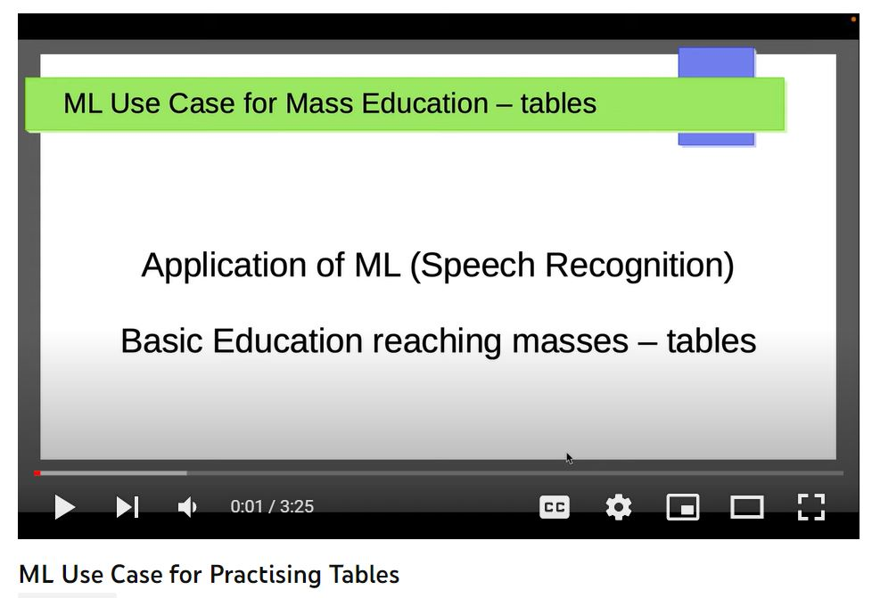
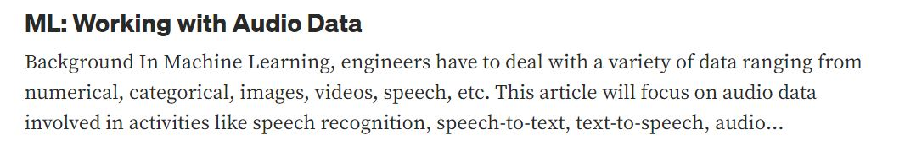

# ML-Audio-Models

[](https://youtu.be/L3L4mEszzTs)

This repository has code working with various audio models like

- **tensorflow**: this has a CNN trained from scratch using collected audio samples
- **whisper**: whisper is a speech to text model developed by OpenAI. This folder has code working with a variety of pretrained models, fine tuning them with your own audio samples, creating datasets for your samples, working with hugging face datasets etc.
- **speech_recognition**: speech_recognition is a python package. It is a speech to text model using Google APIs
  **wave2vec2_xlsr_marathi_mode**
- **samples**: folder has audio recordings of numbers 1 through 40 in marathi
- **working_with_wav_files**: folder has handy snippets of python code required for processing of wav files
- **misc**: folder has miscellaneous handy code developed during the project

[](https://sameermahajan.medium.com/ml-working-with-audio-data-34b296d3e413)

## Current Project Status

We came across whisper model of "DrishtiSharma/whisper-large-v2-marathi" which is reasonable but it is rather large over 6 GB to fit in an android app.

We came across speech commands model (tensor flow CNN) but it is reasonable (~90% accuracy) only upto 20 commands / numbers. However when I try to train it for 40 numbers (each one having around 50 samples) the accuracy drops to around 65%. Not sure whether I need to have more training data and/or build more complex model. The questions here are how much training data we should shoot for and what would be the improved model if we need to go for one.

We explored google recognition / speech_recognition but it needs internet / online connection.

We have put together a [kivy app](https://github.com/sameermahajan/PaadasML) having integration with google speech recognition that you can try out.

We have put together a [flask web app](https://github.com/sameermahajan/PaadasMLFlaskApp) again having integration with google speech recognition that also you can try out. We are looking to host it so that you can try it out directly and will share its link here once done.

We have also put together a [Kivy android app](https://github.com/sameermahajan/Paadas) that can work in conjunction with Marathi voice keyboard(s) though it is [not a very seamless experience](https://youtube.com/shorts/Gfeo_Dyakoc). Also these voice keyboards need internet / online connection and might not be all that great. We think underneath they might anyway be using something like google speech recognition / speech_recognition that we have explored and mentioned above.

We are also exploring wave2vec2_xlsr_marathi_model which is just over 1 GB but need to test further.

## Current Plan

With above findings, we are going to
- put out PaadasML and / or PaadasMLFlaskApp for feedback and audio sample collection
- train tensoflow model with more data (as collected above) and possibly improve the model as RNN, LSTM, more layers etc.

## Issue Deploying pyaudio package on android (ARM)

For using SpeechRecognition package we need pyaudio package. To bundle it in an apk (to deploy and use it on android), it needs to be installed using pip.
There are 3 ways (local linux, google colab, GitHub action) for deploying python apps on android as detailed in https://towardsdatascience.com/3-ways-to-convert-python-app-into-apk-77f4c9cd55af

I tried all three options without any luck. I run into the exact same error on all the systems i.e.

```
/usr/include/limits.h:26:10: fatal error: 'bits/libc-header-start.h' file not found
34939  #include <bits/libc-header-start.h>
34940           ^~~~~~~~~~~~~~~~~~~~~~~~~~
34941  1 error generated.
34942  error: command '/usr/bin/ccache' failed with exit code 1
34943  error: subprocess-exited-with-error
34944  
34945  × Building wheel for pyaudio (pyproject.toml) did not run successfully.
34946  │ exit code: 1
ERROR: Failed building wheel for pyaudio
34954Failed to build pyaudio
34955ERROR: Could not build wheels for pyaudio, which is required to install pyproject.toml-based projects
```

which I am still not able to get around. I think the problem is with cross compilation since all these systems are x86_64 Ubuntu and we want to build the apk for ARM. I could build x86_64 based apk on my local system however it doesn't work on most phones :( One option is to get hold of an ARM system (don't know how to do that :() and try a build there.

I also explored options of python for android and kivy launcher without luck.
